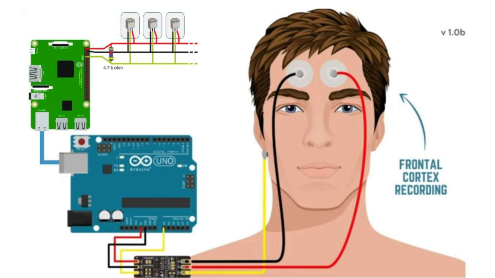

# 🧠 EEG Operated Wheelchair

This project demonstrates a **Brain-Computer Interface (BCI)** system that controls a wheelchair using **EEG (Electroencephalogram) signals**.  
It combines **EEG signal acquisition, machine learning prediction, microcontroller programming, and Raspberry Pi integration** to enable mobility assistance for differently-abled individuals.

---

## 📌 Features
- EEG-based brainwave signal acquisition and processing.
- Machine learning model for classification of EEG patterns (`Prediction.ipynb`).
- Real-time wheelchair control using Arduino (`SlaveProg.ino`, `SpikeRecorder.ino`).
- Raspberry Pi interface for communication and signal processing (`raspberry-pi-prog.py`).
- Hardware design including **3D models and circuit diagrams**.

---

## 📂 Repository Structure

- **3D Model.jpg** → CAD model of the wheelchair design.  
- **EEG Wheelchair.jpg / EEG Wheelchair Assembled.jpg** → Hardware images of the prototype.  
- **EEG_CircuitDiagram.png** → Circuit connections and wiring.  
- **Prediction.ipynb** → ML model for EEG signal classification.  
- **SlaveProg.ino** → Arduino code for motor control.  
- **SpikeRecorder.ino** → EEG data acquisition & preprocessing.  
- **raspberry-pi-prog.py** → Python program to handle data transfer and control logic.  
- **LICENSE** → Open-source license file.  

---

## 🖼️ Project Overview

| Wheelchair Prototype | Circuit Diagram |
|----------------------|-----------------|
|  |  |

| Assembled Wheelchair | 3D CAD Model |
|----------------------|--------------|
|  |  |

---

## 🚀 How It Works
1. EEG signals are recorded using an EEG headset and processed.  
2. The **Prediction.ipynb** notebook classifies signals into commands (e.g., forward, left, right, stop).  
3. The Raspberry Pi (`raspberry-pi-prog.py`) sends commands to the Arduino.  
4. The Arduino programs (`SlaveProg.ino`, `SpikeRecorder.ino`) drive the wheelchair motors accordingly.  

---

## ⚙️ Setup & Installation

### Requirements
- EEG Headset (e.g., OpenBCI or Emotiv).  
- Arduino Uno / Mega.  
- Raspberry Pi (any modern version).  
- Python 3.x with libraries: `numpy`, `scikit-learn`, `matplotlib`.  
- Arduino IDE.  
- Jupyter Notebook.  

### Installation
```bash
# Clone the repo
git clone https://github.com/<your-username>/EEG-Wheelchair.git
cd EEG-Wheelchair

# Install Python dependencies
pip install numpy scikit-learn matplotlib

### **Requirements**:

1. Python 3.x

Libraries: tkinter, matplotlib, pandas (install if needed).

2. CO Monitoring

Open co_monitoring.js in a browser-based environment or integrate into an IoT/web app.

3. Google Earth Engine

Open the link in google earth engine link.txt in your browser.

Requires a Google Earth Engine account for access.

### **📊 Applications**

Smart agriculture and greenhouse management.

Air quality monitoring (CO/CO₂ levels).

Remote sensing integration with Google Earth Engine.

### **👨‍💻 Author**

Developed by MegaZroN (Gaus Mohiuddin Sayyad)
🌐 Portfolio: https://megazron.com
